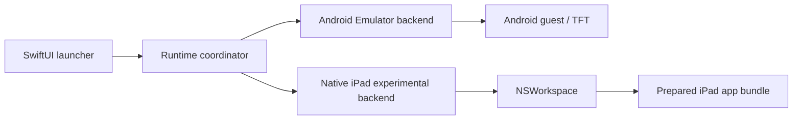
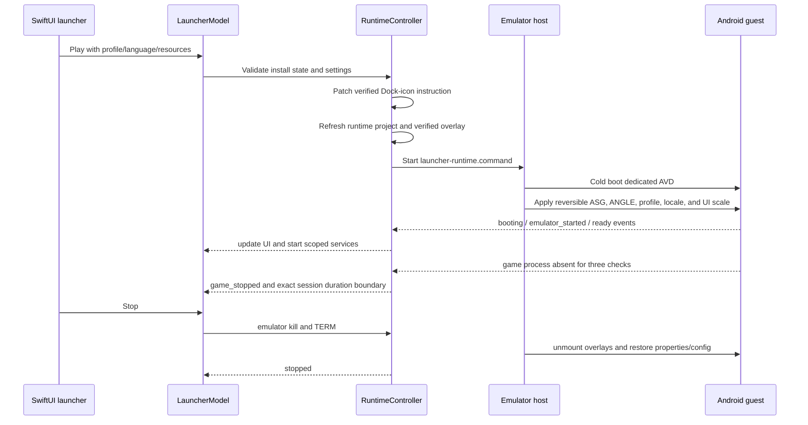
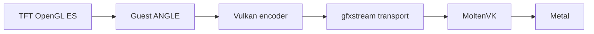

# Architecture

Mactician is a native SwiftUI application that installs and orchestrates
a pinned Android Emulator runtime. It keeps mutable Android data outside the
application bundle so a full app replacement does not replace the AVD or game
state.

## Components

- `MacticianApp.swift` owns application startup, the main window, About, and shutdown.
- `LauncherView.swift`, `LauncherStateViews.swift`, and the supporting component
  files render install, ready, running, failure, and settings surfaces.
- `LauncherModel.swift` is the main-actor presentation model and state machine.
  It validates saved settings, starts installer/runtime operations, maps errors
  to recovery actions, and coordinates hotkeys and login repaint repair.
- `InstallerService.swift` checks the host, verifies game inputs, downloads and
  hashes Android archives, installs the SDK layout, creates the AVD, provisions
  TFT, and persists `InstallState` after each durable stage.
- `RuntimeController.swift` validates the pinned game state, refreshes the small
  launcher-owned runtime project, prepares a verified overlay, starts
  `launcher-runtime.command`, and decodes its JSON-line events.
- `NativeIPadRuntime.swift` defines the parallel runtime contract, adapts the
  existing Android controller, validates and stores a user-selected prepared
  `.app`, and tracks its exact `NSRunningApplication` through `NSWorkspace`.
- `run-tft-root-affinity.command` and `scripts/run-asg-experiment.command` own the
  low-level emulator session, reversible AVD edits, guest overlays, Android
  graphics configuration, and cleanup.
- `InputBridgeService.swift` provides scoped macOS hotkeys only while the
  packaged emulator is active and Android reports TFT's `GameActivity`.
- `RiotLoginAnimationRepairService.swift` removes two completed login-form CSS
  animations through a temporary loopback-only DevTools forward. It does not
  read or modify field values.
- `LauncherUpdateController.swift` exposes Sparkle's update UI.
- `LauncherTelemetryService.swift` owns the bounded retry queues, minimized
  activation/session events, strict message responses, and safe image decoding.
- `LauncherAnnouncementView.swift` renders server-selected messages without
  HTML or executable content.
- `EmulatorHost/main.c` is a minimal app-bundle host for Google's Emulator, used
  to retain the intended Dock identity and icon.

## State and installation

The UI state and the durable install state are related but separate:

```mermaid
stateDiagram-v2
    [*] --> NeedsInstall
    NeedsInstall --> Installing: Accept terms and Install
    Installing --> Ready: manifest, SDK, AVD, and game verified
    Installing --> NeedsInstall: cancel; partial downloads remain resumable
    Installing --> Failed: integrity or process failure
    Ready --> Launching: Play
    Launching --> Playing: runtime ready event
    Launching --> Failed: fail-closed runtime error
    Playing --> Stopping: Stop or app termination
    Stopping --> Ready: overlays and AVD config restored
    Failed --> Installing: Repair
    Failed --> Launching: retry supported launch failure
```



When the experimental feature gate is enabled, the same presentation states
can instead route to the Native iPad backend. Native readiness comes from a
separate validated application bookmark and never changes `InstallState`.



`InstallState.Stage` progresses through `empty`, `downloading`, `sdk_installed`,
`avd_created`, and `ready`. The JSON state also records installed component
versions and a `games` map keyed by `global` and `vietnam`, with each game’s
version, version code, base hash, and overlay hash. Schema 2 migrates the old
single-game schema 1 into Global in memory, preserving its existing AVD and cache.
The selected edition is stored separately in `UserDefaults` (`gameEdition`).
Selection is locked during installation, update checks, and gameplay. A partially written or incompatible state fails back to an empty
state.

Installer outputs are staged before replacement. The runtime project is
refreshed by moving the old directory aside, moving the new copy into place,
and restoring the previous copy if activation fails. Downloads are resumable;
hashes and expected sizes are verified before use.

## Runtime data layout

Default root: `$HOME/Library/Application Support/Mactician`.

```text
sdk/                     pinned Platform Tools, Emulator, and system image
avd/Tft.avd/             Android virtual-device state and game data
runtime-project/         refreshed Mactician-owned scripts and profiles
downloads/               resumable component archives during installation
game/                    Global signed feed, APK releases, and overlay
game/vietnam/            Vietnam signed feed, APK releases, and overlay
.staging/                 transactional temporary files
logs/launcher.log        launcher/runtime diagnostics
install-state.json       durable installation state
native-ipad/
  native-ipad-state.json validated prepared-app bookmark and metadata
```

The bundled Global APKs are verified against `release-manifest.json`. Vietnam
(`com.riotgames.league.teamfighttacticsvn`) downloads on demand from the separately
signed `/mactician/updates/game/vietnam/manifest.json` feed. Global retains
`/mactician/updates/game/manifest.json` and its bundled offline fallback. Both
feeds use the pinned signing key and validate exact package and edition-specific
APK URLs. A cached verified feed supports offline repair; a bad signature or a
cross-edition feed fails closed. APKs are not stored in this source repository.

Both Android packages coexist in the same AVD. Launch, locale, PID polling,
input, FPS, login animation repair, and PSO workers use the selected package.
Host and guest overlays are separated by edition. Reset removes both editions.

## Launch and stop



Normal shutdown, TERM, and the next launch all participate in recovery. Durable
sidecar backups allow `run-asg-experiment.command` to repair an interrupted
configuration before another run. Lock ownership prevents concurrent mutation
of the same AVD.

## Repair, Reset, and updates

Repair repeats host, manifest, component, and game verification; refreshes
Mactician-owned scripts; and reprovisions missing or invalid installation
pieces. It keeps the existing AVD unless corruption requires the explicit Reset
path. The streaming-cache repair removes only `StreamingInstalls` when its
public `Metadata.manifest` is zero bytes.

Reset deletes the complete launcher data root after confirmation. This removes
the AVD, downloads, Riot sign-in, game data, logs, and install state.

Sparkle replaces the complete application bundle atomically. The runtime root
and `UserDefaults` remain outside that bundle, preserving user state. The
current identifiers are `dev.sergeinaumov.mactician`,
`~/Library/Application Support/Mactician`, and
`https://sergeinaumov.dev/mactician/updates/appcast.xml`.

## Telemetry and operator messages

A game session begins only on the runtime `ready` event and ends once on
`game_stopped`, `stopped`, or application shutdown. Its first completion creates
one minimized `first_game_session` event. The event is synchronously persisted
before the request, retried with the same event UUID, and terminally completed
after success, duplicate acknowledgement, unrecoverable 4xx, or seven days.

The launcher version that starts the fresh census creates one independent
`activation_snapshot` for snapshot version 1 on startup when consent is already
known, or immediately after an `unknown` user chooses. It is persisted before
delivery, captures the explicit granted/denied state and consent version, and
retries the same payload and event UUID until a 2xx response. Versioned pending
and completion keys are independent of first-session state.

After the updated telemetry notice is acknowledged, launcher startup also
creates at most one `daily_active` event for the current UTC day. A bounded
eight-event queue preserves heartbeats across temporary failures, while a
separate last-created-day marker prevents another event on the same day. Each
day uses a fresh UUID, so the wire payload has no cross-day identifier.

Every completed session also creates an independent `game_session_summary`
containing only duration and launcher version/build. A bounded 64-event queue
persists summaries across temporary failures regardless of Extended Diagnostics
consent. Each summary uses a fresh event UUID and contains no occurrence time,
settings, device properties, or stable identifier.

An independent, bounded queue stores `game_session_diagnostics` only while
consent version 2 is granted. Revocation synchronously removes that queue before
another request can begin. Diagnostic events contain applied launcher settings
and coarse host properties, but receive independent event UUIDs and no
installation identifier. On migration, the legacy installation UUID and queued
`launcher_started`/`game_session` records are deleted. The full state machine
and payload schemas are documented in [Telemetry and privacy](telemetry.md).

Message lookups use separate `launcher_started` and `game_closed` triggers.
One-time message IDs are remembered in a bounded 128-entry set. The client
refuses redirects and non-HTTPS/cross-origin image URLs, caps JSON at 16 KiB and
images at 2 MiB, accepts only PNG/JPEG, and checks image dimensions and total
pixels with ImageIO before decoding. Message text is rendered as plain SwiftUI
`Text`, never HTML.

## Host/guest boundary and graphics

The macOS host owns SwiftUI, downloads, manifests, the emulator process,
Hypervisor Framework, input filtering, update verification, and transactional
AVD configuration. Android owns app installation, locale, TFT processes, the
official Riot WebView, game state, and guest scheduling.

The selected graphics chain is:



Android HWUI/WebView uses Skia OpenGL to avoid a verified WebView Vulkan
deadlock; this does not disable Vulkan below TFT's ANGLE renderer.

Fixed-stage and cold-boot measurements identify the guest command-serialization,
MMIO/kick, readback, and synchronization boundary as the dominant graphics
bottleneck: the host decoder is usually waiting for work rather than saturating
the transport bandwidth. A shorter guest GLES encoder route was prototyped, but
the current guest/host gfxstream capability contract exposes only ES 3.0 while
TFT actively requires ES 3.1 compute, image, barrier, and texture-buffer
semantics. The evidence, rejected variants, source patches, and implementation
alternatives are recorded in [Native GLES transport experiment](native-gles-transport-experiment.md).

## Fail-closed checks

The launcher refuses to continue on manifest schema errors, unsafe archive
paths, size/hash mismatches, unsupported architecture, insufficient resources,
missing Hypervisor support, an unexpected game version, invalid overlay/profile
hashes, unknown graphics transport, conflicting AVD ownership, incomplete
rollback, unknown autonomous UI states, visible CAPTCHA/MFA, or an unsigned
production update build. Recovery never silently patches an unknown game build.

Performance checkpoints and the foreground collector are independent of that
optional queue. Every Android attempt records runtime, device/settings, timing
and sampled frame data; refusal or consent migration does not stop or discard
performance events. The performance wire event has no consent-version field.
