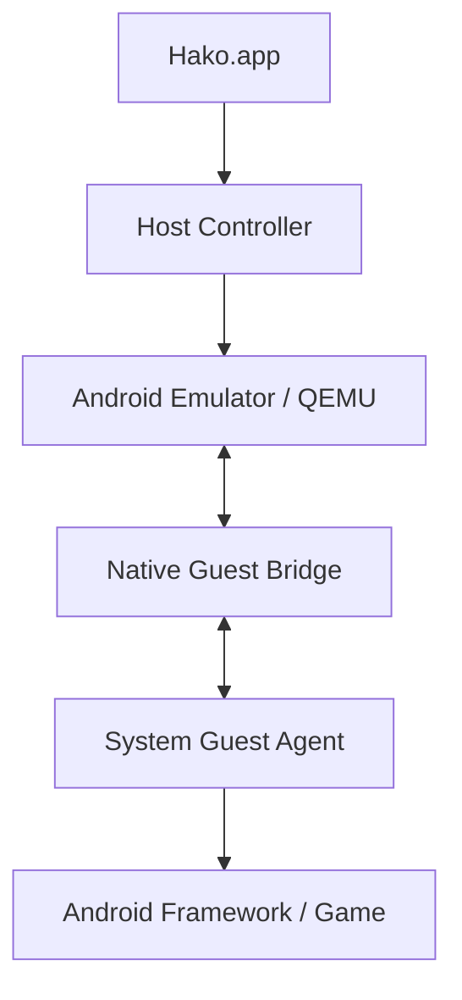

# カスタムAndroid実行環境

Hakoでは、配布済みROMや生成済みuserdataをリポジトリへ含めず、利用者自身のMac上でAndroid実行環境を生成します。

この構成はMuMu Player Proの調査で確認した、VMテンプレートとゲスト側専用機能を事前に用意する設計を参考にしています。ただしMuMuのファイルやコードは使用しません。

## 方針

カスタム実行環境とPlay Store用AVDは分離します。

- `HakoCustom`: root可能なGoogle APIs系ARM64イメージを基に、ゲーム向け設定と任意のGuest Agentを事前導入する
- `PlayStore`: Google Play Store公式イメージをそのまま利用する

Play Storeイメージのsystem領域は改変しません。

初版のカスタム実行環境は厳密には独自ROMではなく、Google APIs系system imageと初期化済みuserdataを組み合わせたローカルVMテンプレートです。独自system imageが必要になった場合は、後からAOSPビルドへ移行します。

## 生成

Android SDK Command-line Tools、Android Emulator、Platform Toolsが必要です。

```zsh
zsh scripts/provision-custom-runtime.command
```

既定値は次の通りです。

- Android API 35
- `google_apis`
- `arm64-v8a`
- 6 CPU
- 6144 MB RAM
- 900x1600
- 240 DPI
- 16 GiB userdata
- AVD名 `HakoCustom`

生成物は通常のAVDディレクトリへ保存され、Gitリポジトリには入りません。

## 初期設定

生成スクリプトは初回起動後に以下を設定します。

- Window / transition / animator animationを無効化
- 画面消灯を実質無効化
- 給電中のスリープを無効化
- 自動画面回転を無効化
- 解像度とDPIを固定
- logcatリングサイズを縮小

既定ではAndroidパッケージを削除または無効化しません。ゲームごとの依存関係を壊しやすいためです。

明示的に無効化したいパッケージがある場合だけ指定します。

```zsh
CUSTOM_DISABLE_PACKAGES="com.example.one com.example.two" \
  zsh scripts/provision-custom-runtime.command
```

## Guest Agent

Guest Agent APKがある場合は初期userdataへ事前導入できます。

```zsh
CUSTOM_GUEST_AGENT_APK="$HOME/path/HakoGuestAgent.apk" \
  zsh scripts/provision-custom-runtime.command
```

初版では通常APKとして `/data` 側へ導入します。

MuMuで確認したようなsystem UIDのpriv-app、framework bridge、native daemonを使う構成へ進む場合は、APKを後から無理に `/system` へコピーするのではなく、AOSPビルド設定へGuest Agentを組み込む方針にします。

想定する最終構成は以下です。



Host ControllerとGuest Agentの通信はADBとは分離します。ADBはデバッグと復旧用に残します。

## 設定変更

環境変数で生成内容を変更できます。

```zsh
CUSTOM_AVD_NAME=HakoGame \
CUSTOM_CPU_CORES=4 \
CUSTOM_MEMORY_MB=4096 \
CUSTOM_WIDTH=1280 \
CUSTOM_HEIGHT=720 \
CUSTOM_DENSITY=240 \
CUSTOM_DATA_SIZE=24576M \
zsh scripts/provision-custom-runtime.command
```

主な変数は以下です。

| 変数 | 既定値 |
| --- | --- |
| `CUSTOM_API_LEVEL` | `35` |
| `CUSTOM_IMAGE_FLAVOR` | `google_apis` |
| `CUSTOM_ABI` | `arm64-v8a` |
| `CUSTOM_AVD_NAME` | `HakoCustom` |
| `CUSTOM_CPU_CORES` | `6` |
| `CUSTOM_MEMORY_MB` | `6144` |
| `CUSTOM_WIDTH` | `900` |
| `CUSTOM_HEIGHT` | `1600` |
| `CUSTOM_DENSITY` | `240` |
| `CUSTOM_DATA_SIZE` | `16384M` |
| `CUSTOM_LOGCAT_SIZE` | `2M` |
| `CUSTOM_EMULATOR_PORT` | `5580` |
| `CUSTOM_RUNTIME_LOG` | `/tmp/hako-custom-runtime.log` |

## 軽量化の進め方

パッケージ削除を先に行うのではなく、アイドル時とゲーム実行時を計測してから対象を決めます。

確認対象は以下です。

- ホストCPU使用率
- ホストメモリ使用量
- ゲスト `/proc/meminfo`
- `dumpsys meminfo`
- `dumpsys activity services`
- `ps -A`
- logcat量
- GPU負荷

無効化候補はゲーム起動、Google認証、ネットワーク、通知、課金などへの影響を確認してから `CUSTOM_DISABLE_PACKAGES` へ追加します。

## 今後

次の段階ではGuest Agentを実装し、ADBに依存しないホスト/ゲスト通信を追加します。

その後、必要性が確認できた場合だけAOSPの独自system imageをビルドし、Guest Agentをpriv-appまたはnative daemonとして組み込みます。ROM生成物自体は配布せず、再現用スクリプトと設定だけをリポジトリで管理します。
